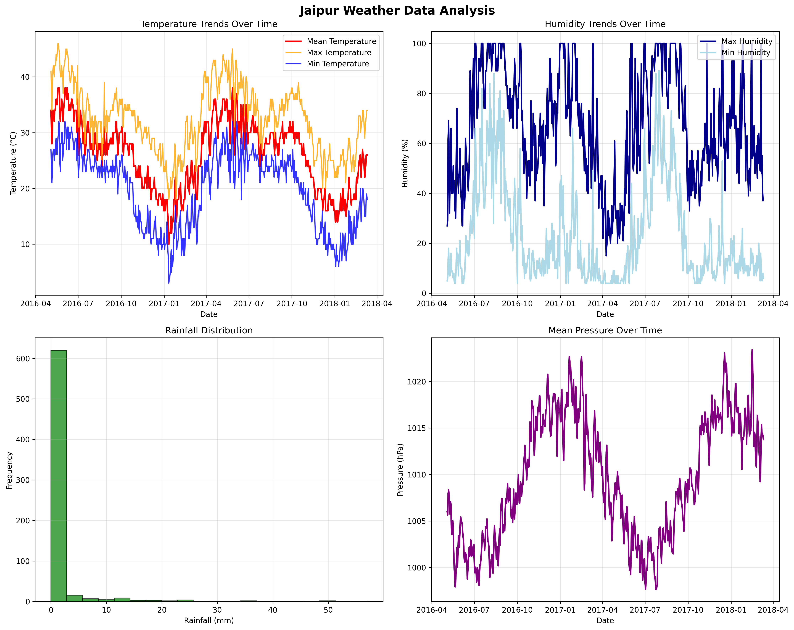

# 🌦️ Jaipur Weather Data Analysis (v2)

This project analyzes daily weather patterns in Jaipur, India, from 2016 to 2018 using Python and visualization libraries like Matplotlib and Seaborn.

## 📁 Project Files

| File | Description |
|------|-------------|
| `weather_data_analysis_submission.ipynb` | Main Jupyter notebook with full analysis |
| `JaipurFinalCleanData.csv` | Weather dataset (676 daily records, 17 variables) |
| `weather_analysis_main.png` | Temperature, humidity, rainfall, and pressure trends |
| `weather_additional_analysis.png` | Monthly averages, correlation heatmap, scatter plots |

## 🔍 Analysis Includes

- Data loading with `pandas`
- Statistical summaries (`mean`, `min`, `max`, `std`)
- Visual trends over time
- Seasonal temperature patterns
- Correlation heatmaps
- Rainfall distribution and temperature comparison

## 📊 Sample Visuals




## 🚀 How to Run

1. Install dependencies:
```bash
pip install pandas matplotlib seaborn numpy
